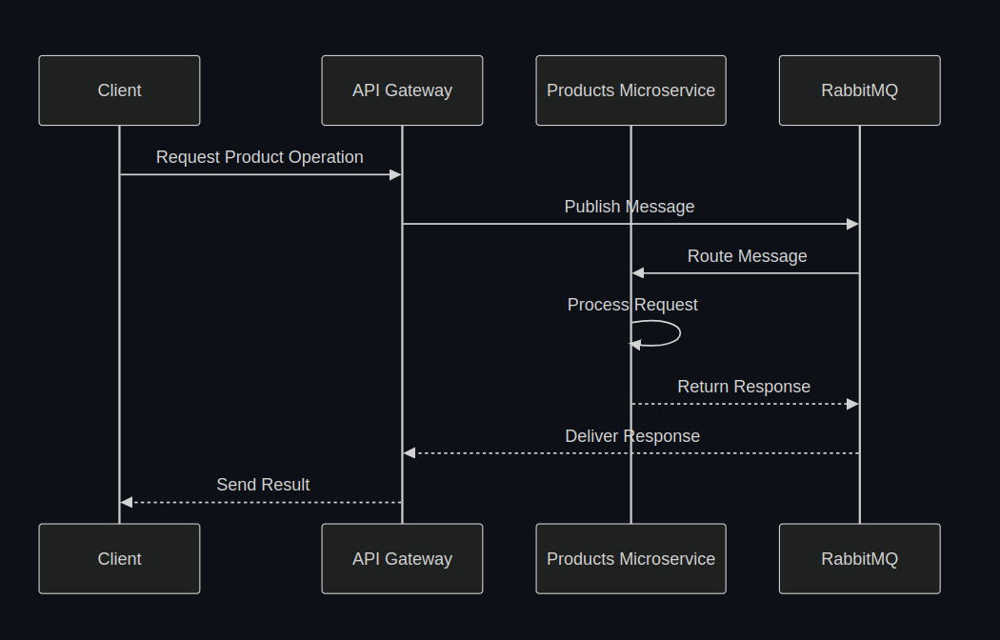

# Microservices Architecture

This project implements a microservices architecture using API Gateway pattern and message queuing with RabbitMQ.

## System Architecture

## Flow Explanation

1. **Client Request**
   - Client sends HTTP request to the API Gateway
   - Requests can be GET, POST, PUT, DELETE operations for products

2. **API Gateway Processing**
   - API Gateway validates the incoming request
   - Transforms the request into a message format
   - Publishes the message to RabbitMQ queue

3. **Message Queuing**
   - RabbitMQ receives the message from API Gateway
   - Routes the message to appropriate microservice queue
   - Ensures message delivery and persistence

4. **Products Microservice**
   - Consumes messages from its dedicated queue
   - Processes the business logic
   - Performs database operations
   - Sends response back through RabbitMQ

5. **Response Flow**
   - Response travels back through RabbitMQ
   - API Gateway receives and transforms the response
   - Client receives the final HTTP response

## Benefits

- **Decoupling**: Services are loosely coupled through message queuing
- **Scalability**: Each component can scale independently
- **Reliability**: Message persistence ensures no data loss
- **Flexibility**: Easy to add new microservices or modify existing ones

## Technologies Used

- NestJS for microservices and API Gateway
- RabbitMQ for message queuing
- TypeScript for type safety
- Docker for containerization
